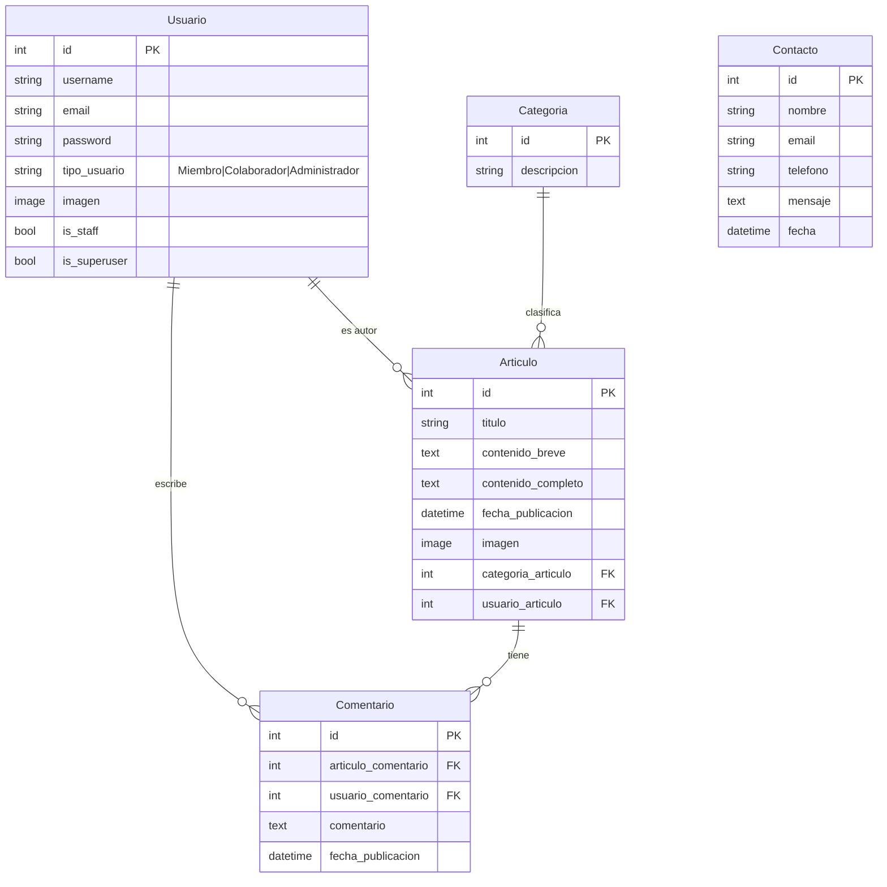

<div align="center">
  <br/>
  
  
  
  
  
  <br/><br/>
</div>

# 🍳 Blog de Cocina — Full Stack Web App

**Plataforma colaborativa de recetas con sistema de roles jerárquicos y experiencia de usuario tipo revista gastronómica.**

> Proyecto final del curso **Desarrollo Web — Informatorio 2024**.  
> Evolucionado con diseño profesional, dark mode, animaciones, pruebas automatizadas y despliegue listo para producción.

---

## 📋 Tabla de Contenidos

- [Stack Tecnológico](#-stack-tecnológico)
- [Features](#-features)
- [Arquitectura del Proyecto](#-arquitectura-del-proyecto)
- [Modelo de Datos](#-modelo-de-datos)
- [Sistema de Roles y Permisos](#-sistema-de-roles-y-permisos)
- [Quick Start](#-quick-start)
- [Entorno de Desarrollo](#-entorno-de-desarrollo)
- [Pruebas](#-pruebas)
- [Producción](#-producción)
- [Mejoras Aplicadas](#-mejoras-aplicadas)
- [Roadmap](#-roadmap)
- [Contribución](#-contribución)
- [Licencia](#-licencia)

---

## 🛠 Stack Tecnológico

| Capa | Tecnología | Versión |
|:-----|:-----------|:-------:|
| **Backend** | Django | 4.2.3 |
| **Lenguaje** | Python | 3.11 |
| **Base de datos** | PostgreSQL / SQLite (dev) | — |
| **Frontend** | Bootstrap 5 + CSS Custom Properties | 5.2.1 |
| **Tipografía** | Playfair Display + Inter | — |
| **Iconos** | Bootstrap Icons | 1.11 |
| **Testing** | pytest + factory-boy + coverage | 7.4 / 3.3 / 7.2 |
| **Imágenes** | Pillow (generación) + Unsplash (fotos reales) | 10.0 |
| **Auth** | django.contrib.auth + Custom User Model | — |
| **ORM** | Django ORM (MySQL/PostgreSQL compatible) | — |

---

## ✨ Features

### 👥 Sistema de Usuarios
- **Registro y autenticación** con validación de formularios cliente + servidor
- **Tres roles jerárquicos**: Miembro, Colaborador, Administrador
- **Perfil** con avatar personalizable
- **Sincronización** automática de grupos mediante Django Signals

### 📝 Gestión de Contenido
- **CRUD completo** de artículos con imágenes
- **Categorías** para organización temática
- **Sistema de comentarios** con permisos por rol
- **Editor de contenido** con formularios validados

### 🎨 Experiencia de Usuario
- **Diseño revista gastronómica** inspirado en blogs profesionales
- **Dark mode** con persistencia en localStorage
- **Animaciones** scroll reveal con IntersectionObserver
- **Responsive design** mobile-first
- **Toast notifications** y feedback visual en formularios
- **Hero full-width** con artículo destacado

### 🔐 Seguridad
- CSRF protection
- Permission-based authorization
- Passwords hasheados con set_password()
- Settings separados por entorno (base/local/production)
- Protección contra XSS, SQL injection (ORM)

---

## 🏗 Arquitectura del Proyecto

```
Blog_Cocina-Django_Python/
├── blog_cocina/                  # Configuración principal
│   ├── settings/
│   │   ├── base.py               # Settings compartidos
│   │   ├── local.py              # Desarrollo (SQLite + debug)
│   │   └── production.py         # Producción (MySQL + HTTPS)
│   ├── urls.py                   # Routing principal
│   ├── views.py                  # Vistas principales (home, acerca_de)
│   └── context_processors.py     # Contexto global (categorías en footer)
│
├── apps/
│   ├── usuarios/                 # Autenticación y roles
│   │   ├── models.py             # Custom User + permisos
│   │   ├── forms.py              # RegistroForm
│   │   ├── views.py              # Login / Logout / Registro
│   │   ├── urls.py
│   │   ├── admin.py
│   │   └── management/
│   │       └── commands/
│   │           └── seed_data.py  # Poblado de BD con datos reales
│   │
│   ├── articulos/                # Core: artículos + comentarios
│   │   ├── models.py             # Articulo, Categoria, Comentario
│   │   ├── forms.py              # ArticuloForm, CategoriaForm, ComentarioForm
│   │   ├── views/                # Vistas modulares (articulos, categorias, comentarios)
│   │   │   ├── articulos.py
│   │   │   ├── categorias.py
│   │   │   └── comentarios.py
│   │   ├── urls.py
│   │   ├── admin.py
│   │   └── tests/                # Tests unitarios + integración
│   │       ├── factories.py
│   │       ├── conftest.py
│   │       ├── test_forms.py
│   │       ├── test_models.py
│   │       ├── test_integration.py
│   │       └── test_views/
│   │
│   └── contacto/                 # Formulario de contacto
│       ├── models.py
│       ├── forms.py
│       ├── views.py
│       └── tests/
│
├── templates/                    # Templates Django
│   ├── base.html                 # Layout principal (navbar, footer, dark mode)
│   ├── index.html                # Home con hero + grid + newsletter
│   ├── acerca_de.html
│   ├── articulos/                # CRUD artículos
│   │   ├── listarArticulos.html
│   │   ├── detalleArticulos.html
│   │   ├── addArticulo.html
│   │   └── edit_articulo.html
│   ├── categorias/               # CRUD categorías
│   ├── contacto/
│   └── usuarios/                 # Login + registro
│
├── static/
│   ├── css/styles.css            # ~22KB de CSS custom (vs 250KB original)
│   └── js/scripts.js             # Dark mode, scroll reveal, validación
│
├── media/articulos/              # Imágenes reales de comida (Unsplash)
├── .env                          # Variables de entorno (local)
├── pytest.ini                    # Configuración de pytest
├── requirements.txt
└── README.md
```

---

## 📊 Modelo de Datos



---

## 🔑 Sistema de Roles y Permisos

| Rol | Publicar | Editar propios | Editar ajenos | Eliminar | Comentar | Admin panel |
|:----|:--------:|:--------------:|:-------------:|:--------:|:--------:|:-----------:|
| **Miembro** | ❌ | ❌ | ❌ | ❌ | ✅ | ❌ |
| **Colaborador** | ✅ | ✅ | ❌ | ✅ propios | ✅ | ❌ |
| **Administrador** | ✅ | ✅ | ✅ | ✅ | ✅ | ✅ |

Implementado mediante **grupos Django** + un campo `tipo_usuario` sincronizado por **signals** (`post_save`).

---

## 🚀 Quick Start

### Prerrequisitos

```bash
python >= 3.11
pip / uv
```

### Instalación

```bash
# 1. Clonar
git clone https://github.com/Gerardo-Rioss/Blog_Cocina-Django_Python.git
cd Blog_Cocina-Django_Python

# 2. Entorno virtual
python -m venv .venv
source .venv/Scripts/activate  # Windows
# source .venv/bin/activate    # Linux/Mac

# 3. Dependencias
pip install -r requirements.txt

# 4. Variables de entorno
echo "SECRET_KEY=django-insecure-dev-key-$(openssl rand -hex 32)" > .env

# 5. Migraciones
python manage.py migrate --settings=blog_cocina.settings.local

# 6. Datos de prueba (opcional)
python manage.py seed_data --settings=blog_cocina.settings.local

# 7. Iniciar servidor
python manage.py runserver --settings=blog_cocina.settings.local
```

### Usuarios de prueba

| Usuario | Contraseña | Rol |
|:--------|:-----------|:----|
| `admin` | `admin123` | 👑 Administrador |
| `colaborador` | `colab123` | ✍️ Colaborador |
| `chef_maria` | `chef123` | ✍️ Colaborador |
| `cocinero_juan` | `cocina123` | ✍️ Colaborador |
| `miembro1` | `miembro123` | 👤 Miembro |
| `lector_ana` | `lector123` | 👤 Miembro |

---

## 🔧 Entorno de Desarrollo

### SQLite para desarrollo local

El archivo `blog_cocina/settings/local.py` ya está configurado para usar SQLite automáticamente. No requiere instalar MySQL.

```python
# local.py
DATABASES = {
    'default': {
        'ENGINE': 'django.db.backends.sqlite3',
        'NAME': BASE_DIR / 'db.sqlite3',
    }
}
```

### Seed data con imágenes reales

```bash
# Regenerar BD desde cero
rm db.sqlite3 media/articulos/*.jpg
python manage.py migrate --settings=blog_cocina.settings.local
python manage.py seed_data --settings=blog_cocina.settings.local
```

El comando `seed_data` descarga/puebla:
- **10 categorías** gastronómicas
- **6 usuarios** con distintos roles
- **20 artículos** con imágenes reales de Unsplash (800×500px)
- **30 comentarios** distribuidos aleatoriamente
- **5 mensajes** de contacto

---

## 🧪 Pruebas

### Suite completa

```bash
pytest --ds=blog_cocina.settings.local -v
```

### Con reporte de cobertura

```bash
pytest --ds=blog_cocina.settings.local --cov=apps --cov-report=term-missing
```

### Resultados actuales

```
✅ 146 passed, 0 failed, 0 errors
```

**Tests incluidos:**
- Models: creación, validación, constraints, relaciones, helpers de permisos
- Forms: validación de campos requeridos, formatos inválidos, edge cases
- Views: status codes, templates, redirects, permisos por rol
- Integration: flujo completo registro → login → CRUD → comentarios
- Signals: sincronización automática de grupos Django

---

## 📦 Producción

### Configurar producción

```bash
export DJANGO_SETTINGS_MODULE=blog_cocina.settings.production
export SECRET_KEY="tu-secret-key-segura"
export DB_NAME=blog_cocina
export DB_USER=deploy
export DB_PASSWORD="contraseña-segura"
export DB_HOST=localhost
export ALLOWED_HOSTS=.tudominio.com
```

### Recomendaciones de deploy

- **Hosting:** Render (Railway, PythonAnywhere)
- **Base de datos:** PostgreSQL (Render) o MySQL (Railway)
- **Static/Media:** WhiteNoise o CDN (Cloudinary/S3)
- **HTTPS:** Forzado vía settings.production + proxy

---

## 🎯 Mejoras Aplicadas

| Área | Antes | Después |
|:-----|:------|:--------|
| **CSS** | 250KB (Bootstrap duplicado) | **~22KB** de CSS custom optimizado |
| **JS** | Vacío | Dark mode, scroll reveal, toasts, validación frontend |
| **Templates** | HTML mal formado, botones anidados | **Semántica limpia**, diseño revista profesional |
| **Navbar** | Fondo oscuro genérico | **Navbar blur** con indicador activo |
| **Footer** | "Your Website 2023" | Footer completo con redes, catálogo, navegación |
| **Hero** | Estático | **Dinámico** con artículo destacado + overlay |
| **Comentarios** | `<button><a>` anidados | Sistema moderno tipo card con acciones |
| **Dark mode** | ❌ No existía | ✅ Toggle con persistencia y preferencia del sistema |
| **Imágenes** | Placeholder 1×1 | **20 fotos reales de Unsplash** (22-160KB) |
| **Formularios** | `form.as_table` | Cards estilizadas con feedback visual |
| **Login/Registro** | Básico | Cards centradas con iconografía |
| **Tests** | 8 errores pre-existentes | **146 tests, 0 fallos** |
| **Factory Usuario** | No funcionaba | `_create` override con grupos exclusivos |
| **Settings** | Single file | Base + Local + Production separados |
| **Migrations** | Desincronizadas (contacto) | **Sync completas** |

---

## 🗺 Roadmap

### High Priority
- [x] Dark mode completo
- [x] Diseño revista profesional
- [x] Imágenes reales de comida
- [x] Sistema de roles funcional
- [x] Tests automatizados (146 ✅)

### Medium Priority
- [ ] Buscador full-text de artículos
- [ ] Paginación en listado
- [ ] Tags/etiquetas en artículos
- [ ] Perfil de usuario público
- [ ] Editor WYSIWYG (rich text)
- [ ] WebP/AVIF para imágenes optimizadas
- [ ] Docker + docker-compose

### Future
- [ ] API REST (DRF)
- [ ] Social login (Google, GitHub)
- [ ] Recetas favoritas / bookmarks
- [ ] Notificaciones push
- [ ] Reportes de contenido inapropiado
- [ ] SEO optimizado (Open Graph + Schema.org)
- [ ] CI/CD con GitHub Actions
- [ ] CDN para media

---

## 🤝 Contribución

1. Fork el proyecto
2. Creá tu feature branch (`git checkout -b feature/nueva-funcionalidad`)
3. Hacé commit de tus cambios (`git commit -m 'feat: agregar X'`)
4. Push al branch (`git push origin feature/nueva-funcionalidad`)
5. Abrí un Pull Request

**Convenciones de commits:** Conventional Commits (`feat:`, `fix:`, `refactor:`, `test:`, `docs:`)

---

## 📄 Licencia

Este proyecto fue desarrollado como trabajo final del **Informatorio 2024** — Desarrollo Web con Django y Python.

---

<div align="center">
  <sub>Built with ❤️ by Gerardo Ríos & Grupo 4 — Informatorio</sub>
  <br/>
  <sub>
    <a href="https://github.com/Gerardo-Rioss">GitHub</a> · 
    <a href="https://rios-gerardo.netlify.app">Portfolio</a> · 
    <a href="https://linkedin.com/in/gerardrioss/">LinkedIn</a>
  </sub>
</div>
